<div align="center">

# PretrainLab-X

### An auditable LLaMA-style pretraining stack for data, training-systems, and generalization experiments

**336M long-run pretraining · ~500M processed token positions · FineWeb-Edu · shared held-out evaluation · reproducibility audit**


**English** · [简体中文](README_CN.md) · [Technical Report](results/pdf/PretrainLab-X_Day8_Technical_Report.pdf) · [Reproducibility](REPRODUCIBILITY.md) · [Results](results/final_metrics.json)

</div>

---

## At a glance

| | |
|---|---:|
| **Long-run model** | 336,118,784 parameters |
| **Training budget** | 15,259 optimizer steps |
| **Processed token positions** | 500,006,912 |
| **Non-replayed training corpus** | 505,007,770 tokens |
| **Largest model path validated** | 653,477,120 parameters |
| **Shared held-out set** | 8,666 documents / 9,992,428 scored tokens |
| **Held-out NLL** | 8.424 → **3.039** |
| **Paired NLL gap** | 5.3848 |
| **95% paired-bootstrap interval** | [5.3671, 5.4029] |
| **Primary long-run hardware** | 1 × NVIDIA RTX PRO 6000 96GB |

<p align="center">
  
</p>

## Why this project exists

PretrainLab-X started as a systems exercise: build a pretraining stack that could survive more than a toy run. The scope expanded naturally once the first 336M long run exposed a data problem that a training loop alone would not catch.

The first long run processed roughly 500M token positions from a 9.9M-token training slice. The training budget looked large, but the underlying corpus was being replayed repeatedly. I rebuilt the data pipeline around a ~505M-token FineWeb-Edu corpus, reran the same 336M model at approximately the same processed-token budget without dataset replay, and evaluated both frozen checkpoints under one shared held-out protocol.

The repository therefore captures the full path from **model and trainer implementation** to **data-pipeline correction**, **long-run pretraining**, **controlled checkpoint comparison**, **statistical validation**, and **artifact audit**.

## System

### Model
- Decoder-only Transformer with **RMSNorm**, **RoPE**, **SwiGLU**, and **grouped-query attention (GQA)**.
- PyTorch scaled-dot-product attention through the `sdpa_auto` backend.
- Activation checkpointing support for larger configurations.

### Training engine
- **BF16** mixed-precision training.
- Gradient accumulation and gradient clipping.
- Warmup + cosine learning-rate schedule.
- Checkpoint save/resume with model, optimizer, scheduler, and RNG state.
- JSONL telemetry for loss, learning rate, gradient norm, GPU memory/utilization, and throughput.

### Data pipeline
- FineWeb-Edu ingestion and preprocessing.
- Length filtering, control-character cleanup, exact-text deduplication, and document-boundary train/validation splitting.
- Tokenizer provenance and token-file hashes.
- Non-replayed token cursor for the Day 6 long run.

### Evaluation and audit
- Shared held-out next-token evaluation for frozen checkpoints.
- Token-weighted NLL and perplexity.
- 10,000-sample paired bootstrap at document level.
- Random-initialization baseline.
- BF16 / FP32 numerical cross-check.
- SHA-256 manifests for checkpoints and held-out data.

```mermaid
flowchart LR
    A[FineWeb-Edu / bounded corpus] --> B[Filter + clean + deduplicate]
    B --> C[Document-level split]
    C --> D[Tokenize + pack]
    D --> E[LLaMA-style decoder]
    E --> F[BF16 trainer]
    F --> G[Checkpoint + telemetry]
    G --> H[Shared held-out evaluation]
    H --> I[Bootstrap + sanity checks]
    I --> J[SHA-256 audit]
```



## Experimental path

| Stage | Purpose | Verified outcome |
|---|---|---|
| **Training-stack validation** | Exercise optimizer, scheduler, recovery, and diagnostics | 30.42M model; 500-step normal/high-LR/resume runs |
| **Scale-up validation** | Check larger model code paths | 336M and 653M short BF16 benchmarks |
| **FSDP path check** | Validate distributed initialization/wrapping path | `world_size=1`; forward/backward/optimizer path passed |
| **Repeated-corpus long run** | Establish a high-repetition baseline | 336M; 15,259 steps; ~500M processed token positions |
| **Non-replayed long run** | Train at matched scale/budget without dataset replay | 336M; 15,259 steps; ~500M corpus token positions |
| **Shared held-out evaluation** | Compare frozen checkpoints under one protocol | Day 5 NLL 8.424 vs Day 6 NLL 3.039 |
| **Sanity + audit** | Stress-test the interpretation and evidence chain | train/held-out checks, random baseline, BF16/FP32, SHA-256 |

## Repetition, memorization, and generalization

The core comparison is not “more steps vs fewer steps.” Both long runs use the same 336M model scale and essentially the same processed-token budget; what changes is how the training corpus is consumed.

| Checkpoint | Training regime | Training-side NLL | Shared held-out NLL |
|---|---|---:|---:|
| **Day 5** | 9.9M-token slice replayed across the long run | **0.065** on the original training slice | **8.424** |
| **Day 6** | ~500M positions consumed from a ~505M-token corpus without replay | **3.049** on a fixed 10M training prefix | **3.039** |

<p align="center">
  
</p>

The repeated-corpus checkpoint fits its training slice extremely closely but transfers poorly to the shared held-out stream. The non-replayed checkpoint shows nearly identical NLL on its fixed training subset and the held-out data.

Across 8,666 paired held-out documents, Day 5 minus Day 6 weighted NLL was **5.3848**, with a 95% paired-bootstrap interval of **[5.3671, 5.4029]**.

This supports a strong memorization/generalization contrast in this experimental setting. It is not a single-variable causal proof that “fresh data is always better”; the two checkpoints have different full training histories.

## Long-run behavior

The Day 6 run completed **15,259 optimizer steps** and processed **500,006,912 token positions** from the non-replayed training stream.

<p align="center">
  
</p>

The curve is included as direct evidence of the full long-run trajectory rather than only its endpoint.

## Training stability and recovery

The training stack was also exercised under deliberately different optimization conditions.

| 30.42M stability run | Final loss | Max pre-clip grad norm |
|---|---:|---:|
| Normal LR | **0.01553** | 15.012 |
| High LR (`3e-3`) | **0.04462** | 19.085 |

The diagnostics track **pre-clip** global gradient norm while the trainer still applies `grad_clip=1.0` before the optimizer update. A separate resume test restored the step-400 checkpoint and reproduced the step-500 result.

These runs validate stability diagnostics and recovery behavior; they are not model-quality benchmarks.

<details>
<summary><b>Diagnostic endpoint views</b></summary>

<br>

<p align="center">
  
</p>

<p align="center">
  
</p>

</details>

## Repository map

```text
model/          LLaMA-style model and attention components
engine/         trainer, scheduler, optimizer and checkpoint logic
data/           preprocessing and tokenizer adapters
distributed/    FSDP entry point and wrapper
evaluation/     held-out evaluation, bootstrap, sanity and audit code
monitor/        JSONL logging, GPU/gradient probes and diagnostics
experiments/    benchmark and long-run configurations/scripts
results/        reports and machine-readable experiment evidence
figures/        release figures generated from checked-in evidence
audit/          canonical hash manifests and cross-checks
docs/           design, data, experiment and evaluation notes
tests/          component-level checks
```

## Reproduce a smoke run

The public release excludes raw token arrays and large model checkpoints. A small local smoke configuration can be run with prepared local data:

```bash
python -m venv .venv
. .venv/bin/activate
pip install -r requirements.txt

python prepare_data.py --config configs/debug.yaml
python train.py --config configs/debug.yaml
python verify_run.py --run-dir .
```

For exact experiment boundaries, data assumptions, and GPU configurations, see [`REPRODUCIBILITY.md`](REPRODUCIBILITY.md).

## Evidence trail

- [`results/final_metrics.json`](results/final_metrics.json) — canonical release metrics
- [`results/`](results/) — human-readable and machine-readable experiment records
- [`audit/CANONICAL_HASH_MANIFEST.json`](audit/CANONICAL_HASH_MANIFEST.json) — canonical file hashes
- [`audit/HASH_CROSSCHECK.json`](audit/HASH_CROSSCHECK.json) — independent hash cross-check
- [`figures/`](figures/) — release figures
- [`results/pdf/PretrainLab-X_Day8_Technical_Report.pdf`](results/pdf/PretrainLab-X_Day8_Technical_Report.pdf) — technical report
- [`LIMITATIONS.md`](LIMITATIONS.md) — interpretation boundaries

## Scope

The public release contains source code, configurations, small machine-readable evidence, figures, and reports. Large checkpoints, raw corpora, packed token arrays, and offline W&B binaries are intentionally excluded.

The **336M** configuration is the completed long-run experiment. The **653M** configuration is a short path-validation benchmark. The FSDP path was exercised with `world_size=1`, so it is not presented as a multi-GPU scaling result. Attention in the recorded runs uses **PyTorch SDPA**, not a third-party `flash-attn` installation.

---

<div align="center">

**PretrainLab-X** · training systems, data pipelines, and evidence-driven evaluation

</div>
