```mermaid
flowchart LR
    A[FineWeb-Edu] --> B[Filter + clean + deduplicate]
    B --> C[Document-level split]
    C --> D[Tokenize + pack]
    D --> E[LLaMA-style decoder]
    E --> F[BF16 trainer]
    F --> G[Checkpoint + telemetry]
    G --> H[Shared held-out evaluation]
    H --> I[Bootstrap + sanity checks]
    I --> J[SHA-256 audit]
```

<div align="center">

# PretrainLab-X

### Data-Centric Pretraining at Scale — Long-Run Training, Failure Diagnostics, and Auditable Generalization

**336M long-run pretraining · ~500M processed token positions · FineWeb-Edu · fault injection · shared held-out evaluation · paired bootstrap · reproducibility audit**


**English** · [简体中文](README_CN.md) · [Technical Report](results/pdf/PretrainLab-X_Day8_Technical_Report.pdf) · [Reproducibility](REPRODUCIBILITY.md) · [Canonical Metrics](results/final_metrics.json)

</div>

---

## At a glance

| | |
|---|---:|
| **Completed long-run model** | 336,118,784 parameters |
| **Largest validated model path** | 653,477,120 parameters |
| **Long-run budget** | 15,259 optimizer steps |
| **Processed token positions** | 500,006,912 |
| **Non-replayed training corpus** | 505,007,770 train tokens |
| **Shared held-out evaluation** | 8,666 documents / 9,992,428 scored tokens |
| **Held-out NLL** | 8.424 → **3.039** |
| **Paired NLL gap** | 5.3848 |
| **95% paired-bootstrap interval** | [5.3671, 5.4029] |
| **Primary long-run hardware** | 1 × NVIDIA RTX PRO 6000 96GB |

<p align="center">
  
</p>

## Project arc

PretrainLab-X covers the core path of a foundation-model pretraining project: **model architecture, data pipelines, training infrastructure, stability diagnostics, checkpoint recovery, scale-up validation, long-running pretraining, controlled evaluation, statistical testing, and artifact auditing**. The stack was progressively scaled from small validation runs to 336M / 653M configurations, culminating in two 336M runs of 15,259 optimizer steps and roughly 500M processed token positions each.

The first 336M run exposed a more important issue than whether training loss continued to decrease: **roughly 500M token positions were being consumed from an underlying training slice of only 9.9M tokens.** The corpus was therefore being replayed many times. That observation shifted the next experiment toward data coverage. The pipeline was rebuilt around approximately **505M FineWeb-Edu training tokens**, and the 336M run was repeated at essentially the same model scale and processed-token budget without dataset replay.

The two resulting checkpoints were then evaluated under a common protocol rather than compared through their training losses. Model configuration, tokenizer, context length, evaluation code, and held-out corpus were fixed across both runs. Next-token evaluation covered **8,666 documents and 9,992,428 scored tokens**, followed by **10,000 paired bootstrap resamples**. The resulting weighted NLL was **8.424 for Day 5 and 3.039 for Day 6**.

That gap became the next engineering question: whether it reflected generalization behavior or an artifact of checkpoint integrity, evaluation code, numerical precision, data overlap, or training-set memorization. The project therefore added strict checkpoint loading, configuration matching, a random-init baseline, Day 5 training-corpus evaluation, Day 6 training-subset evaluation, BF16 / FP32 cross-checks, held-out overlap screening, and multi-implementation SHA-256 verification.

The project progression can be summarized as:

```text
model + trainer
      ↓
real-data pipeline
      ↓
scale-up validation
      ↓
336M repeated-corpus long run
      ↓
data-replay problem identified
      ↓
~505M-token non-replayed corpus rebuild
      ↓
336M long run repeated at matched token budget
      ↓
shared held-out evaluation
      ↓
paired bootstrap + sanity checks + artifact audit
```

## System

### Model
- Decoder-only Transformer.
- **RMSNorm, RoPE, SwiGLU, GQA**.
- Main 336M configuration: `dim=1024`, `24` layers, `16` query heads, `4` KV heads, context length `512`.
- PyTorch scaled-dot-product attention through the `sdpa_auto` backend.
- Activation checkpointing support for larger configurations.

### Training engine
- **BF16** mixed-precision training.
- Gradient accumulation and gradient clipping.
- Warmup + cosine learning-rate schedule.
- Stateful checkpoints containing model, optimizer, scheduler, and RNG state.
- Checkpoint resume validated from step 400 → 500.
- JSONL telemetry for loss, learning rate, pre-clip gradient norm, GPU memory, GPU utilization, and throughput.
- Monitoring is kept separate from intervention: diagnostics record and flag behavior without silently rewriting LR, batch size, or optimizer state.

### Evaluation stack
- Shared held-out next-token evaluation for frozen checkpoints.
- Token-weighted NLL and perplexity.
- Document-level paired bootstrap.
- Random-initialization baseline.
- BF16 / FP32 numerical cross-check.
- Checkpoint/configuration equality checks.
- Token-window overlap screening.
- SHA-256 provenance and final artifact audit.



## Data engineering

The data pipeline grew from a small real-data slice into a corpus large enough to support a non-replayed long run.

### Real-data integration: 10M-token corpus

The first FineWeb-Edu pipeline established the full preprocessing path:

| Item | Value |
|---|---:|
| Documents inspected | 8,479 |
| Documents retained | 8,478 |
| Exact duplicates removed | 1 |
| Cleaned characters | 39,822,471 |
| Total tokens | 10,000,000 |
| Train / validation | 9,900,000 / 100,000 |
| Tokenizer | TinyLlama tokenizer, vocab 32,000, EOS 2 |

This 9.9M-token train slice later became the substrate for the repeated-corpus Day 5 run.

### Non-replayed corpus: 510M total tokens

For Day 6, the pipeline was rebuilt from a ~2.15 GB FineWeb-Edu parquet source. Train/validation separation was performed at document boundaries before packing.

| Item | Value |
|---|---:|
| Train documents | 427,260 |
| Validation documents | 4,243 |
| Exact duplicates removed | 395 |
| Train tokens | 505,007,770 |
| Validation tokens | 5,000,809 |
| Total tokens | 510,008,579 |
| Packed token file | 2,040,034,316 bytes (`int32`) |

The source parquet was integrity-checked before preprocessing. The packed token stream and metadata were retained with SHA-256 provenance.

## Scale-up and distributed-path validation

Before launching the long runs, the same training stack was exercised at larger model sizes on the real-data pipeline.

| Configuration | Parameters | Steps | Precision | Verified path |
|---|---:|---:|---|---|
| 336M benchmark | 336,118,784 | 8 | BF16 | forward / backward / update |
| 653M benchmark | 653,477,120 | 4 | BF16 | larger-model execution path |
| FSDP path | 336,118,784 | 16 | BF16 | init / wrap / forward / backward / optimizer |

The FSDP run used `world_size=1`; PyTorch therefore operated in `NO_SHARD`. It verifies the distributed code path, not multi-GPU sharding or communication.

The scale-up stage also produced machine-readable summaries and a scaling report.

## Two 336M long runs

The formal Day 5 and Day 6 runs use the same 336,118,784-parameter model and the same 15,259-step / 500,006,912-position budget.

| | Day 5 — repeated corpus | Day 6 — non-replayed corpus |
|---|---:|---:|
| Model | 336,118,784 params | 336,118,784 params |
| Steps | 15,259 | 15,259 |
| Tokens / optimizer step | 32,768 | 32,768 |
| Processed token positions | 500,006,912 | 500,006,912 |
| Underlying train corpus | 9.9M tokens | 505,007,770 tokens |
| Data regime | repeated replay of the small slice | consumed without dataset replay |
| Precision | BF16 | BF16 |
| Wall time | ~3 h 31 m | ~3.55 h |
| Final checkpoint | ~4.03 GB | ~4.03 GB |

The Day 5 run recorded **39,424.75 tokens/s average throughput**, **77.24% average GPU utilization**, and roughly **7.3 GB peak allocated training memory**. The run completed normally and retained sampled low-utilization warnings rather than filtering them out.

Day 6 first passed a **100-step smoke run**, then completed the full 15,259-step training run. The best recorded validation loss was **3.14276 at step 15,000**.

<p align="center">
  
</p>

## Day 5 vs. Day 6: one shared held-out exam

The two checkpoints were frozen and scored through the same next-token evaluation path. Both checkpoints were at step 15,259 and use the same architecture, tokenizer, vocabulary, EOS ID, and context length.

### Held-out construction

The evaluation set was built from FineWeb-Edu `sample-10BT`, candidate shard `013_00000.parquet`:

- 8,681 candidate rows inspected.
- 8,666 complete documents retained.
- 10,000,094 tokens produced before document-boundary masking.
- Exact-text deduplication inside the candidate set.
- Same cleaning and tokenizer path used by the training pipeline.
- 64-token-window SHA-256 screening with stride 16 against the reconstructable Day 5 9.9M-token stream.
- **15 candidate documents rejected** by the exact token-window screen.
- Candidate shard separated from the Day 6 training shard (`000_00000.parquet`).

The Day 5 source path did not preserve full shard/URL provenance, so the overlap control is reported exactly as implemented: **token-window screening + source-shard separation**.

### Identical scoring protocol

Both checkpoints were evaluated with:

- `model.eval()`
- `torch.inference_mode()`
- BF16 autocast
- no backward pass
- no optimizer update
- token-weighted causal cross-entropy
- identical evaluation code
- identical held-out stream

The 10M-token held-out stream yields **9,992,428 scored next-token targets** after document boundaries are respected.

| Checkpoint | Documents | Scored tokens | Weighted NLL | Perplexity |
|---|---:|---:|---:|---:|
| **Day 5 repeated-corpus** | 8,666 | 9,992,428 | **8.424211** | 4,556.051 |
| **Day 6 non-replayed** | 8,666 | 9,992,428 | **3.039400** | 20.893 |

<p align="center">
  
</p>

The same 8,666 document IDs were then resampled **10,000 times** with a paired bootstrap (`seed=1337`) while preserving document token counts:

- Day 5 − Day 6 weighted NLL: **5.384811**
- 95% percentile interval: **[5.367100, 5.402861]**

NLL is the primary statistic in this repository; perplexity is retained as an auxiliary view.

## Stress-testing the result

The shared held-out gap was large enough to warrant a second evaluation layer. Day 7 was run in read-only mode: no retraining and no weight updates.

### 1. Checkpoint integrity
Both 336M checkpoints were re-hashed and loaded with `strict=True`.

- `missing_keys = []`
- `unexpected_keys = []`
- parameter count = 336,118,784 for both
- both checkpoints at step 15,259

### 2. Model/configuration equality
The comparison matched:

- hidden size `1024`
- 24 Transformer layers
- 16 query heads
- 4 KV heads
- context length `512`
- vocabulary `32,000`
- EOS ID `2`
- TinyLlama tokenizer

Result: `day5_day6_model_config_equal = true`.

### 3. Random-init baseline
A randomly initialized model with the same architecture and evaluation path was scored on 500,000 held-out targets:

- NLL: **10.574821**
- Perplexity: ~**39,100**

The evaluation path therefore separates an untrained model from both trained checkpoints.

### 4. Training-side re-evaluation
Both checkpoints were scored again on training-side data:

| Checkpoint | Training-side NLL | Shared held-out NLL |
|---|---:|---:|
| **Day 5** | **0.065023** on the full 9.9M-token training slice | **8.424211** |
| **Day 6** | **3.049181** on a fixed 10M-token training prefix | **3.039400** |

<p align="center">
  
</p>

The Day 5 checkpoint nearly saturates its repeated training slice while performing much worse on held-out text. Day 6 shows almost the same NLL on its fixed training subset and shared held-out data.

### 5. BF16 / FP32 cross-check
The first 100,000 scored held-out tokens were re-evaluated in both BF16 and FP32:

| Model | BF16 NLL | FP32 NLL | FP32 − BF16 |
|---|---:|---:|---:|
| Day 5 | ~8.424 | ~8.424 | −0.0001667 |
| Day 6 | ~3.039 | ~3.039 | −0.0000198 |

The ranking remains unchanged and the precision deltas are tiny.

### 6. Evaluation consistency
The shared held-out result was reproduced again during the sanity-check stage: approximately **8.424 vs. 3.039**.

Taken together, these checks leave a much narrower explanation space for the observed gap: the strongest remaining signal is the contrast between heavy small-corpus repetition and high-coverage non-replayed training.

## Training stability, fault injection, and recovery

The training engine was exercised under deliberately abnormal optimization conditions, not only under the nominal configuration.

### Normal vs. high-learning-rate stress test

A 30.42M-parameter model was trained for 500 steps under both the normal setup and an independent high-LR (`3e-3`) stress setup.

| Run | Final loss | Best loss | Max pre-clip grad norm | Validation loss |
|---|---:|---:|---:|---:|
| **Normal LR** | **0.015530** | 0.014527 | 15.012 | 0.015689 |
| **High LR (`3e-3`)** | **0.044620** | 0.042047 | **19.085** | 0.046229 |

The high-LR run stayed numerically finite but converged to a substantially worse loss and produced larger pre-clipping gradient norms.

The observability path records the global gradient norm **before** clipping. The trainer then applies `grad_clip=1.0` before the optimizer update, so the diagnostic signal remains visible while the update itself is bounded.

### Deterministic anomaly injection

A separate anomaly demo was used to exercise the diagnostic layer with deliberately abnormal traces. It reproducibly triggered:

- `loss_spike`
- `gradient_explosion_risk`

### Recovery run

After the stress configuration, a full 500-step recovery run restored the normal LR, warmup, and clipping setup:

- final loss: `0.015530`
- best loss: `0.014527`
- validation loss: `0.015689`

The recovery run returned to the normal baseline.

### Stateful checkpoint resume

Checkpoints were written every 100 steps with model, optimizer, scheduler, and RNG state. A step-400 checkpoint was reloaded and training continued to step 500, reproducing the original step-500 loss of `0.015530`.

This validates stateful training recovery rather than weight-only loading.

<details>
<summary><b>Diagnostic endpoint views</b></summary>

<br>

<p align="center">
  
</p>

<p align="center">
  
</p>

</details>

## Reproducibility and artifact audit

The release keeps machine-readable experiment evidence next to the narrative reports.

After the sanity checks, the three artifacts used in the final comparison were hashed directly with three independent implementations:

- `sha256sum`
- OpenSSL
- Python `hashlib`

All three agreed on:

- the Day 5 checkpoint
- the Day 6 checkpoint
- the shared held-out token stream

The final audit also caught two transcription errors in earlier documentation: one missing character in the held-out hash and one adjacent-character transposition in the Day 6 checkpoint hash. The canonical manifest was regenerated from the source files and pre-patch copies were retained.

Canonical evidence:

- [`results/final_metrics.json`](results/final_metrics.json)
- [`audit/CANONICAL_HASH_MANIFEST.json`](audit/CANONICAL_HASH_MANIFEST.json)
- [`audit/HASH_CROSSCHECK.json`](audit/HASH_CROSSCHECK.json)
- [`results/`](results/)
- [`figures/`](figures/)
- [`results/pdf/PretrainLab-X_Day8_Technical_Report.pdf`](results/pdf/PretrainLab-X_Day8_Technical_Report.pdf)

The release package also passed component-level checks covering RMSNorm, RoPE, SwiGLU, GQA, full-model forward, and training-observability logic, followed by a repository audit for required files, JSON validity, hash format, forbidden large artifacts, and obvious secret patterns.

## Repository map

```text
model/          LLaMA-style model and attention components
engine/         trainer, scheduler, optimizer and checkpoint logic
data/           preprocessing and tokenizer adapters
distributed/    FSDP entry point and wrapper
evaluation/     held-out evaluation, bootstrap, sanity and audit code
monitor/        JSONL logging, GPU/gradient probes and diagnostics
experiments/    benchmark and long-run configurations/scripts
results/        reports and machine-readable experiment evidence
figures/        release figures generated from checked-in evidence
audit/          canonical hash manifests and cross-checks
docs/           design, data, experiment and evaluation notes
tests/          component-level checks
```

## Reproduce a smoke run

The public release excludes raw corpora, packed token arrays, and large checkpoints. A small smoke configuration can be run with prepared local data:

```bash
python -m venv .venv
. .venv/bin/activate
pip install -r requirements.txt

python prepare_data.py --config configs/debug.yaml
python train.py --config configs/debug.yaml
python verify_run.py --run-dir .
```

See [`REPRODUCIBILITY.md`](REPRODUCIBILITY.md) for experiment boundaries, data assumptions, and GPU configurations.

## Scope

- **336M** is the completed long-run configuration.
- **653M** is a short path-validation benchmark.
- FSDP was exercised at `world_size=1`; this repository does not report multi-GPU scaling.
- The recorded attention backend is **PyTorch SDPA**, not a third-party `flash-attn` installation.
- The Day 5 / Day 6 comparison is best read as a controlled contrast between a heavily replayed small corpus and a high-coverage non-replayed corpus at matched model scale and processed-token budget.

Full interpretation boundaries are documented in [`LIMITATIONS.md`](LIMITATIONS.md).

---

<div align="center">

**PretrainLab-X** · pretraining systems, data pipelines, failure diagnostics, and evidence-driven evaluation

</div>
