<p align="center">
  <b>English</b> | <a href="./README_CN.md">简体中文</a>
</p>
# PretrainLab-X

## A production-shaped mini foundation-model pretraining stack

PretrainLab-X is an inspectable, reproducible **engineering-scale** decoder-only language-model pretraining stack. It implements a modern LLaMA-style model, a BF16 single-GPU trainer, checkpoint/resume, monitoring, evaluation, and auditable experiment reports. The repository is deliberately honest about scale: it demonstrates the complete path from data to evidence, not industrial-scale capability.

**中文简介：**这是一个可检查、可复现的基础模型预训练工程栈。它包含现代 LLaMA 风格模型、BF16 训练、梯度控制、断点恢复、监控、共享留出评估和哈希审计；实验规模是面向作品集的缩小版，不冒充工业级预训练。

## What is implemented

- Decoder-only Transformer with RMSNorm, RoPE, SwiGLU and grouped-query attention (GQA).
- PyTorch scaled-dot-product attention (SDPA) with the `sdpa_auto` backend. The project does **not** claim that the third-party `flash-attn` wheel is installed.
- BF16 autocast, gradient accumulation, gradient clipping, warmup + cosine learning-rate schedule, atomic checkpointing, optimizer/scheduler/RNG restoration, and optional activation checkpointing.
- FineWeb-Edu preprocessing code with explicit filtering, deduplication, document-boundary split, tokenizer provenance, and token-file hashes.
- Local JSONL metrics, optional offline W&B logging, health diagnostics, shared held-out evaluation, bootstrap confidence intervals, sanity checks, and SHA-256 audit manifests.

## Evidence at a glance

| Evidence | Result | Boundary |
|---|---:|---|
| Strict Day 2-3 model | 30,419,456 parameters; 500 steps | deterministic byte-level fallback corpus |
| Day 4 300M benchmark | 336,118,784 parameters; 8 steps | short benchmark, not 3B-token training |
| Day 4 700M benchmark | 653,477,120 parameters; 4 steps | short benchmark, not 5B-token training |
| Day 5 long run | 336M; 15,259 steps; 500,006,912 processed tokens; final loss 0.069339 | 9.9M-token slice is replayed |
| Day 6 fresh-data run | 336M; 15,259 steps; 500,006,912 unique tokens | single-GPU bounded run |
| Shared held-out evaluation | Day 5 NLL 8.424211 vs Day 6 NLL 3.039400; paired Δ=5.384811 | not a causal proof of freshness |
| Day 7 sanity/audit | checkpoint/configuration/precision checks passed | no new training or weight edits |

The canonical numbers are machine-readable in [`results/final_metrics.json`](results/final_metrics.json). Human-readable evidence is in [`results/`](results/).

## System overview

```mermaid
flowchart LR
  A[FineWeb-Edu / bounded corpus] --> B[filter + deduplicate + tokenize]
  B --> C[document-boundary train/validation split]
  C --> D[LLaMA-style decoder]
  D --> E[BF16 trainer]
  E --> F[accumulation + clipping + warmup/cosine]
  F --> G[checkpoint + JSONL + optional offline W&B]
  G --> H[shared held-out evaluation]
  H --> I[sanity checks + hash audit + release evidence]
```



## Quick start (CPU smoke test)

The public release intentionally excludes raw token arrays and model checkpoints. To run a tiny CPU smoke test with your own prepared token arrays:

```bash
python -m venv .venv
. .venv/bin/activate
pip install -r requirements.txt
python prepare_data.py --config configs/debug.yaml
python train.py --config configs/debug.yaml
python verify_run.py --run-dir .
```

For a GPU benchmark on a machine with the required data, see [`REPRODUCIBILITY.md`](REPRODUCIBILITY.md). Long-run checkpoints and raw data are intentionally kept private.

## Repository map

```text
model/          LLaMA-style model and attention components
engine/         trainer, scheduler, checkpoint implementation
data/           preprocessing and tokenizer adapters (no raw arrays)
distributed/    FSDP entry point and wrapper
evaluation/     held-out evaluation, bootstrap, sanity and audit code
monitor/        JSONL/W&B logger, GPU/gradient probes, diagnostics
experiments/    benchmark and long-run configurations/scripts
results/        human-readable reports and small machine-readable evidence
figures/        release figures generated from checked-in evidence
audit/          canonical hash manifest and cross-check report
docs/           design, data, experiment and evaluation notes
```

## Scope and limitations

This is a portfolio-grade, auditable engineering project. It is not a claim of industrial pretraining, multi-node scaling, or a causal study that isolates data freshness. Read [`LIMITATIONS.md`](LIMITATIONS.md) before interpreting any number.

## License and provenance

Add a license only after checking the provenance of every copied component and the terms of any external tokenizer or dataset. The release currently ships source and reports without asserting a license for third-party data or checkpoints.
