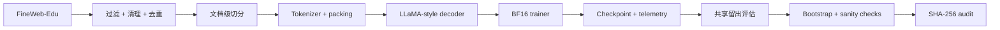

<div align="center">

# PretrainLab-X

### 面向数据中心扩展、故障感知训练与可审计泛化的端到端基础模型预训练系统

**336M 长程预训练 · 约 5 亿 processed token positions · FineWeb-Edu · 故障注入 · 共享留出评估 · 配对 Bootstrap · 可复现审计**


[English](README.md) · **简体中文** · [技术报告](results/pdf/PretrainLab-X_Day8_Technical_Report.pdf) · [复现说明](REPRODUCIBILITY.md) · [核心指标](results/final_metrics.json)

</div>

---

## 核心数字

| | |
|---|---:|
| **完成长程训练的主模型** | 336,118,784 参数 |
| **已验证的最大模型路径** | 653,477,120 参数 |
| **长程训练预算** | 15,259 optimizer steps |
| **处理 token positions** | 500,006,912 |
| **不回放训练语料** | 505,007,770 个训练 token |
| **共享留出评估** | 8,666 篇文档 / 9,992,428 个可评分 token |
| **共享留出 NLL** | 8.424 → **3.039** |
| **配对 NLL 差值** | 5.3848 |
| **95% 配对 Bootstrap 区间** | [5.3671, 5.4029] |
| **正式长跑硬件** | 1 × NVIDIA RTX PRO 6000 96GB |

<p align="center">
  
</p>

## 项目主线

PretrainLab-X 覆盖了一个基础模型预训练项目真正需要打通的核心链路：**模型架构、数据管线、训练引擎、稳定性监控、checkpoint 恢复、规模放大、长程训练、统一评估、统计检验与结果审计**。项目从小规模训练验证逐步扩展到 336M / 653M 参数配置，并最终完成两次 336M、15,259 steps、约 5 亿 token positions 的长程训练。

第一次 336M 长跑很快暴露出一个比“loss 能不能继续下降”更关键的问题：**5 亿次 token 消费背后，实际只有 990 万 token 的训练语料在被反复重放。** 这使项目从单纯验证训练系统，进一步转向研究数据覆盖率对模型行为的影响。随后重新构建了一套约 **5.05 亿 train tokens** 的 FineWeb-Edu 数据流，在保持模型规模和训练预算基本一致的条件下，再完成一次无数据集回放的 336M 长程训练。

两次训练结束后，没有只比较各自的 training loss，而是把两个 checkpoint 放进同一套独立评估体系：统一模型配置、Tokenizer、上下文长度、评估代码和共享 held-out corpus，在 **8,666 篇文档、9,992,428 个可评分 token** 上进行 next-token evaluation，并进一步做 **10,000 次 paired bootstrap**。最终 Day 5 与 Day 6 的 weighted NLL 分别为 **8.424 和 3.039**。

这个差距又引出了下一层问题：它究竟来自真正的泛化差异，还是 checkpoint、评估代码、数值精度、数据重叠或训练集记忆造成的假象？因此项目继续向下做了 checkpoint strict loading、模型配置一致性检查、random-init baseline、Day 5 原训练集回测、Day 6 训练子集回测、BF16 / FP32 交叉评估、held-out overlap screening、SHA-256 多实现交叉审计。

整个项目的推进路线可以概括为：

```text
模型 + 训练引擎
      ↓
真实数据管线
      ↓
规模放大验证
      ↓
336M 重复语料长跑
      ↓
发现数据回放问题
      ↓
重建约 5.05 亿 token 不回放语料
      ↓
相同 336M / 相近 token 预算重新长跑
      ↓
共享留出考试
      ↓
配对 Bootstrap + Sanity Check + 文件审计
```

## 系统实现

### 模型
- Decoder-only Transformer。
- **RMSNorm、RoPE、SwiGLU、GQA**。
- 336M 主配置：`dim=1024`、24 层、16 个 Query Head、4 个 KV Head、上下文长度 512。
- 注意力后端为 PyTorch scaled-dot-product attention，运行记录为 `sdpa_auto`。
- 支持 activation checkpointing。

### 训练引擎
- **BF16** 混合精度训练。
- Gradient accumulation 与 gradient clipping。
- Warmup + cosine learning-rate schedule。
- Stateful checkpoint：保存 model、optimizer、scheduler、RNG 状态。
- step 400 → 500 的 checkpoint resume 已实际验证。
- JSONL 记录 loss、learning rate、裁剪前 gradient norm、GPU 显存、GPU 利用率和 throughput。
- 监控与干预解耦：诊断系统记录和报警，不在训练中静默修改学习率、batch size 或 optimizer 状态。

### 评估体系
- 两份冻结 checkpoint 使用同一共享留出集做 next-token evaluation。
- Token-weighted NLL 与 Perplexity。
- 文档级 paired bootstrap。
- Random-init baseline。
- BF16 / FP32 数值交叉核验。
- checkpoint / config 一致性检查。
- token-window overlap screening。
- SHA-256 provenance 与最终文件审计。



## 数据工程

数据管线从一个真实数据小切片，逐步扩展到足够支撑不回放长跑的 510M-token 规模。

### 第一阶段：10M-token 真实数据管线

第一套 FineWeb-Edu 数据管线完整跑通了清洗、去重、切分和 tokenization：

| 项目 | 数值 |
|---|---:|
| 检查文档 | 8,479 |
| 保留文档 | 8,478 |
| 删除精确重复文档 | 1 |
| 清理后字符数 | 39,822,471 |
| 总 token | 10,000,000 |
| train / validation | 9,900,000 / 100,000 |
| Tokenizer | TinyLlama，vocab 32,000，EOS 2 |

这 9.9M-token train slice 后来成为 Day 5 重复语料长跑的底层训练数据。

### 第二阶段：510M-token 不回放语料

Day 6 从约 2.15 GB 的 FineWeb-Edu Parquet 源重新构建数据集，并在文档边界先做 train/validation 切分，再进行 packing：

| 项目 | 数值 |
|---|---:|
| 训练文档 | 427,260 |
| 验证文档 | 4,243 |
| 删除精确重复文档 | 395 |
| 训练 token | 505,007,770 |
| 验证 token | 5,000,809 |
| 总 token | 510,008,579 |
| packed token 文件 | 2,040,034,316 bytes (`int32`) |

原始 Parquet 在预处理前做完整性检查；处理后的 token stream 与元数据保留 SHA-256 provenance。

## 模型放大与分布式路径验证

正式长跑前，同一套训练栈先在真实 FineWeb-Edu 数据管线上验证更大模型配置。

| 配置 | 参数量 | Steps | 精度 | 验证内容 |
|---|---:|---:|---|---|
| 336M benchmark | 336,118,784 | 8 | BF16 | forward / backward / update |
| 653M benchmark | 653,477,120 | 4 | BF16 | 更大模型执行路径 |
| FSDP path | 336,118,784 | 16 | BF16 | init / wrap / forward / backward / optimizer |

FSDP 这次使用 `world_size=1`，PyTorch 实际为 `NO_SHARD`。这里验证的是分布式代码路径，而不是多卡参数分片或通信性能。

该阶段同时生成 scaling report 与机器可读 summary。

## 两次 336M 长程训练

Day 5 与 Day 6 使用相同的 336,118,784 参数模型，并保持相同的 15,259-step / 500,006,912-position 预算。

| | Day 5 — 重复语料 | Day 6 — 不回放语料 |
|---|---:|---:|
| 模型 | 336,118,784 参数 | 336,118,784 参数 |
| Steps | 15,259 | 15,259 |
| 每步 token | 32,768 | 32,768 |
| 处理 token positions | 500,006,912 | 500,006,912 |
| 底层 train corpus | 9.9M token | 505,007,770 token |
| 数据方式 | 小语料反复 replay | 不进行 dataset replay |
| 精度 | BF16 | BF16 |
| 训练耗时 | 约 3 小时 31 分 | 约 3.55 小时 |
| 最终 checkpoint | 约 4.03 GB | 约 4.03 GB |

Day 5 记录到平均吞吐 **39,424.75 token/s**、平均 GPU 利用率 **77.24%**、峰值训练显存约 **7.3 GB**。训练正常完成，同时保留了运行过程中采样到的低 GPU 利用率告警。

Day 6 先完成 **100-step smoke test**，再执行正式 15,259-step 长跑；正式训练最佳 validation loss 为 **3.14276（step 15,000）**。

<p align="center">
  
</p>

## Day 5 / Day 6：同一张共享留出试卷

两个 checkpoint 在训练结束后全部冻结，并通过同一条 next-token 评估路径考试。两边都处于 step 15,259，并使用相同的模型结构、Tokenizer、词表、EOS 和上下文长度。

### 留出集构建

共享留出集来自 FineWeb-Edu `sample-10BT` 的候选分片 `013_00000.parquet`：

- 检查 8,681 条候选记录。
- 保留 8,666 篇完整文档。
- 文档边界处理前构建 10,000,094 个 token。
- 候选集内部做精确文本去重。
- 使用与训练数据相同的清洗和 Tokenizer 路径。
- 针对可重建的 Day 5 9.9M-token 流执行 **64-token window / stride 16 的 SHA-256 overlap screening**。
- **15 篇候选文档被筛掉**。
- 候选分片与 Day 6 训练分片 `000_00000.parquet` 分离。

Day 5 当时没有保留完整 shard / URL provenance，因此这里记录实际完成的控制：**token-window screening + source-shard separation**。

### 完全一致的评估协议

两边都使用：

- `model.eval()`
- `torch.inference_mode()`
- BF16 autocast
- 不做 backward
- 不做 optimizer update
- token-weighted causal cross-entropy
- 同一评估脚本
- 同一 held-out stream

10M-token 的留出流在尊重文档边界后，最终得到 **9,992,428 个可评分 next-token target**。

| Checkpoint | 文档数 | 可评分 token | Weighted NLL | Perplexity |
|---|---:|---:|---:|---:|
| **Day 5 重复语料** | 8,666 | 9,992,428 | **8.424211** | 4,556.051 |
| **Day 6 不回放语料** | 8,666 | 9,992,428 | **3.039400** | 20.893 |

<p align="center">
  
</p>

随后对同一组 8,666 个文档 ID 做 **10,000 次 paired bootstrap**（`seed=1337`），并保留每篇文档的 token 权重：

- Day 5 − Day 6 weighted NLL：**5.384811**
- 95% percentile interval：**[5.367100, 5.402861]**

README 以 NLL 作为主统计量，Perplexity 作为辅助视图。

## 把结果继续往下追

共享留出差距足够大，因此又增加了一层只读验证。Day 7 不重新训练、不更新权重，只检查这个差距还能不能被别的因素解释。

### 1. Checkpoint 完整性
两个 336M checkpoint 都重新计算 SHA-256，并用 `strict=True` 加载：

- `missing_keys = []`
- `unexpected_keys = []`
- 两边参数量都是 336,118,784
- 两边都处于 step 15,259

### 2. 模型与配置一致性
逐项确认：

- hidden size `1024`
- 24 层 Transformer
- 16 个 Query Head
- 4 个 KV Head
- context length `512`
- vocab `32,000`
- EOS `2`
- 同一个 TinyLlama Tokenizer

结果：`day5_day6_model_config_equal = true`。

### 3. Random-init baseline
使用相同结构、相同评估协议的随机初始化模型，在前 500,000 个可评分 token 上测试：

- NLL：**10.574821**
- Perplexity：约 **39,100**

评估链路能够明确区分未训练模型与两份训练后 checkpoint。

### 4. 回到训练侧重新考试
两个模型又分别回到训练侧数据重新评估：

| Checkpoint | 训练侧 NLL | 共享留出 NLL |
|---|---:|---:|
| **Day 5** | 原始 9.9M 训练切片上 **0.065023** | **8.424211** |
| **Day 6** | 固定 10M 训练前缀上 **3.049181** | **3.039400** |

<p align="center">
  
</p>

Day 5 在重复训练切片上已经接近“背熟”，但共享留出 NLL 明显更高；Day 6 的固定训练子集与共享留出集则基本处于同一水平。

### 5. BF16 / FP32 数值交叉核验
在同一留出集前 100,000 个可评分 token 上，分别使用 BF16 与 FP32 重新评估：

| 模型 | BF16 NLL | FP32 NLL | FP32 − BF16 |
|---|---:|---:|---:|
| Day 5 | ~8.424 | ~8.424 | −0.0001667 |
| Day 6 | ~3.039 | ~3.039 | −0.0000198 |

两种精度的差异极小，模型排名完全不变。

### 6. 再次复现共享考试
Day 7 sanity-check 阶段再次得到约 **8.424 vs. 3.039** 的共享留出结果。

这一轮检查把解释空间继续压缩：checkpoint 损坏、结构不一致、随机基线异常、数值精度差异、两侧评估协议不一致，都没有解释掉这个结果。剩下最显眼的信号，就是**高重复小语料训练与高覆盖不回放训练之间的记忆化—泛化差异**。

## 训练稳定性、故障注入与恢复

训练引擎不仅在正常配置下运行，还专门做了异常优化条件下的压力测试。

### 正常基线 vs 高学习率压力实验

同一个 30.42M 参数模型分别完成正常配置和高学习率 `3e-3` 的 500-step 独立训练。

| 实验 | 最终 loss | 最佳 loss | 最大裁剪前 grad norm | Validation loss |
|---|---:|---:|---:|---:|
| **Normal LR** | **0.015530** | 0.014527 | 15.012 | 0.015689 |
| **High LR (`3e-3`)** | **0.044620** | 0.042047 | **19.085** | 0.046229 |

高学习率组没有直接炸成 NaN / Inf，但最终 loss、validation loss 和裁剪前梯度都明显更差。

Observatory 记录的是 **gradient clipping 之前**的全局梯度范数；真正 optimizer update 之前仍执行 `grad_clip=1.0`。因此系统既能看到风险信号，又能限制实际参数更新幅度。

### 主动异常注入

另外单独运行了确定性的 anomaly demo，人为构造异常训练轨迹，并稳定触发：

- `loss_spike`
- `gradient_explosion_risk`

### Recovery run

高学习率压力实验之后，恢复正常 learning rate、warmup 与 gradient clipping，再独立运行完整 500 steps：

- final loss：`0.015530`
- best loss：`0.014527`
- validation loss：`0.015689`

恢复组重新回到正常 baseline。

### Stateful checkpoint resume

每 100 step 保存一次 checkpoint，并包含 model、optimizer、scheduler 与 RNG 状态。随后从 step 400 checkpoint 恢复训练到 step 500，最终重新得到 `0.015530`，与原始正式 run 的 step-500 结果一致。

这验证的是完整训练状态恢复，而不是只证明模型权重可以重新读取。

<details>
<summary><b>诊断端点视图</b></summary>

<br>

<p align="center">
  
</p>

<p align="center">
  
</p>

</details>

## 可复现性与文件审计

公开版本同时保留人类可读报告和机器可读实验结果。

Sanity check 完成后，最终比较所依赖的三份文件又分别使用三种独立实现重新计算 SHA-256：

- `sha256sum`
- OpenSSL
- Python `hashlib`

三种方法对以下三份文件全部得到一致结果：

- Day 5 checkpoint
- Day 6 checkpoint
- shared held-out token stream

这次审计还抓到两处早期文档转录错误：held-out hash 漏了一个字符，Day 6 checkpoint hash 出现相邻字符转置。最终权威 manifest 直接从原始文件重新生成，并保留修补前版本作为审计记录。

权威证据入口：

- [`results/final_metrics.json`](results/final_metrics.json)
- [`audit/CANONICAL_HASH_MANIFEST.json`](audit/CANONICAL_HASH_MANIFEST.json)
- [`audit/HASH_CROSSCHECK.json`](audit/HASH_CROSSCHECK.json)
- [`results/`](results/)
- [`figures/`](figures/)
- [`results/pdf/PretrainLab-X_Day8_Technical_Report.pdf`](results/pdf/PretrainLab-X_Day8_Technical_Report.pdf)

最终发布包还执行了 RMSNorm、RoPE、SwiGLU、GQA、完整模型 forward、训练观测逻辑等组件级自检，并通过仓库发布审计检查必需文件、JSON、哈希格式、禁止的大文件后缀和明显敏感信息。

## 仓库结构

```text
model/          LLaMA 风格模型与注意力组件
engine/         trainer、scheduler、optimizer 与 checkpoint
data/           数据预处理与 tokenizer 适配
distributed/    FSDP 入口与封装
evaluation/     留出评估、bootstrap、sanity 与 audit
monitor/        JSONL 日志、GPU/梯度监控与异常诊断
experiments/    benchmark 与 long-run 配置/脚本
results/        实验报告与机器可读证据
figures/        基于仓库内证据生成的发布图表
audit/          权威哈希清单与交叉核验
docs/           系统设计、数据、实验与评估说明
tests/          组件级自检
```

## 快速运行

公开仓库不提交原始语料、packed token 数组和大模型 checkpoint。使用准备好的本地小型数据即可运行 smoke configuration：

```bash
python -m venv .venv
. .venv/bin/activate
pip install -r requirements.txt

python prepare_data.py --config configs/debug.yaml
python train.py --config configs/debug.yaml
python verify_run.py --run-dir .
```

完整实验边界、数据假设与 GPU 配置见 [`REPRODUCIBILITY.md`](REPRODUCIBILITY.md)。

## 范围

- **336M** 是完成正式长程训练与对照评估的主模型。
- **653M** 用于短程路径验证。
- FSDP 在 `world_size=1` 下完成代码路径验证，本仓库不报告多 GPU scaling 结果。
- 实验记录中的注意力后端为 **PyTorch SDPA**。
- Day 5 / Day 6 的主对照是：相同模型规模和基本一致的 processed-token budget 下，**高重复小语料**与**高覆盖不回放语料**的训练结果。

完整实验边界见 [`LIMITATIONS.md`](LIMITATIONS.md)。

---

<div align="center">

**PretrainLab-X** · 预训练系统、数据管线、故障诊断与证据驱动评估

</div>
