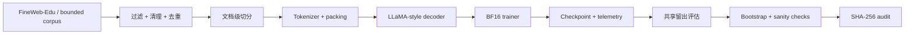

<div align="center">

# PretrainLab-X

### 一套可审计的 LLaMA 风格预训练系统：从数据管线到长程训练、泛化评估与复现审计

**336M 长程预训练 · 约 5 亿 processed token positions · FineWeb-Edu · 共享留出评估 · 可复现审计**


[English](README.md) · **简体中文** · [技术报告](results/pdf/PretrainLab-X_Day8_Technical_Report.pdf) · [复现说明](REPRODUCIBILITY.md) · [核心结果](results/final_metrics.json)

</div>

---

## 核心数字

| | |
|---|---:|
| **正式长跑模型** | 336,118,784 参数 |
| **训练预算** | 15,259 optimizer steps |
| **处理 token positions** | 500,006,912 |
| **不回放训练语料** | 505,007,770 token |
| **已验证的最大模型路径** | 653,477,120 参数 |
| **共享留出集** | 8,666 篇文档 / 9,992,428 个可评分 token |
| **共享留出 NLL** | 8.424 → **3.039** |
| **配对 NLL 差值** | 5.3848 |
| **95% 配对 Bootstrap 区间** | [5.3671, 5.4029] |
| **正式长跑硬件** | 1 × NVIDIA RTX PRO 6000 96GB |

<p align="center">
  
</p>

## 项目主线

PretrainLab-X 最初只是为了把一套现代预训练训练栈真正跑通，但第一次 336M 长跑暴露出了一个比“代码能不能跑”更重要的问题：**处理了很多 token，并不等于模型看到了很多不同的数据。**

第一次长跑处理了约 5 亿个 token position，但底层训练切片只有 990 万 token，训练过程中发生了高度重复。随后重新构建约 5.05 亿 token 的 FineWeb-Edu 训练语料，在相同 336M 模型规模和近似 token 预算下完成不回放长跑，再把两份冻结 checkpoint 放到同一套共享留出协议上评估。

因此，这个仓库记录的不只是模型和训练代码，而是一条完整的实验链路：**系统实现 → 数据问题发现 → 数据管线重建 → 长程重训 → 统一评估 → 统计检验 → sanity check → 哈希审计。**

## 系统实现

### 模型
- Decoder-only Transformer。
- **RMSNorm、RoPE、SwiGLU、GQA**。
- 注意力后端为 PyTorch scaled-dot-product attention，运行记录为 `sdpa_auto`。
- 支持 activation checkpointing，用计算换显存。

### 训练引擎
- **BF16** 混合精度训练。
- Gradient accumulation 与 gradient clipping。
- Warmup + cosine learning-rate schedule。
- Checkpoint 保存与恢复：模型、optimizer、scheduler、RNG 状态。
- JSONL telemetry：loss、learning rate、gradient norm、GPU 显存/利用率、throughput。

### 数据管线
- FineWeb-Edu 接入与预处理。
- 长度过滤、控制字符清理、精确文本去重、文档级 train/validation 切分。
- Tokenizer 来源记录与 token 文件 SHA-256。
- Day 6 使用不回放 token cursor，避免训练数据集循环回放。

### 评估与审计
- 两份冻结 checkpoint 使用同一共享留出流进行 next-token evaluation。
- Token-weighted NLL 与 perplexity。
- 10,000 次文档级 paired bootstrap。
- 随机初始化 baseline。
- BF16 / FP32 数值交叉核验。
- Checkpoint 与留出数据 SHA-256 清单。



## 实验推进路径

| 阶段 | 目的 | 已核验结果 |
|---|---|---|
| **训练系统验证** | 跑通 optimizer、scheduler、恢复和诊断链路 | 30.42M 模型；500 步正常 / 高 LR / 恢复实验 |
| **模型放大验证** | 检查大参数配置的前向、反向与更新路径 | 336M 与 653M BF16 短程基准 |
| **FSDP 路径验证** | 检查分布式初始化与包装路径 | `world_size=1`；forward / backward / optimizer 路径通过 |
| **重复语料长跑** | 建立高重复训练基线 | 336M；15,259 步；约 5 亿 processed token positions |
| **不回放长跑** | 在相同规模和预算下避免 dataset replay | 336M；15,259 步；约 5 亿 corpus token positions |
| **共享留出评估** | 用同一协议比较冻结 checkpoint | Day 5 NLL 8.424；Day 6 NLL 3.039 |
| **Sanity + Audit** | 检查结论是否来自加载、数值或文件问题 | train/held-out、随机基线、BF16/FP32、SHA-256 |

## 从语料重复到泛化

这里比较的不是“多跑几步”和“少跑几步”。两次正式长跑使用相同的 336M 模型规模和基本匹配的 processed-token budget，核心差异在于训练语料如何被消费。

| Checkpoint | 训练方式 | 训练侧 NLL | 共享留出 NLL |
|---|---|---:|---:|
| **Day 5** | 990 万 token 切片反复回放 | 原始训练切片上 **0.065** | **8.424** |
| **Day 6** | 从约 5.05 亿 token 语料中不回放消费约 5 亿位置 | 固定前 1000 万训练 token 上 **3.049** | **3.039** |

<p align="center">
  
</p>

Day 5 对重复训练切片拟合得极深，但到了共享留出数据上性能明显下降；Day 6 的固定训练子集 NLL 与共享留出 NLL 基本一致。

在 8,666 篇配对文档上，Day 5 减 Day 6 的加权 NLL 差值为 **5.3848**；10,000 次配对 Bootstrap 的 95% 区间为 **[5.3671, 5.4029]**。

这个结果支持本实验设置下存在明显的**记忆化—泛化差异**。它不是“新鲜数据永远更好”的单变量因果证明，因为两份 checkpoint 的完整训练历史并不完全相同。

## 长程训练轨迹

Day 6 完成 **15,259 个 optimizer step**，从不回放训练流中消费 **500,006,912 个 token position**。

<p align="center">
  
</p>

这里保留完整训练轨迹，而不是只展示一个最终 loss。

## 训练稳定性与恢复

训练系统还专门做过不同优化条件下的压力测试。

| 30.42M 稳定性实验 | 最终 loss | 最大裁剪前 grad norm |
|---|---:|---:|
| 正常学习率 | **0.01553** | 15.012 |
| 高学习率 `3e-3` | **0.04462** | 19.085 |

监控记录的是**裁剪前**全局梯度范数，因此可以捕捉 gradient risk 和 loss spike；真正更新参数前训练器仍执行 `grad_clip=1.0`。此外还从 step 400 checkpoint 恢复训练到 step 500，并复现最终结果。

这部分用于验证训练稳定性、异常诊断与恢复机制，不作为模型能力 benchmark。

<details>
<summary><b>诊断端点视图</b></summary>

<br>

<p align="center">
  
</p>

<p align="center">
  
</p>

</details>

## 仓库结构

```text
model/          LLaMA 风格模型与注意力组件
engine/         trainer、scheduler、optimizer 与 checkpoint
data/           数据预处理与 tokenizer 适配
distributed/    FSDP 入口与封装
evaluation/     留出评估、bootstrap、sanity 与 audit
monitor/        JSONL 日志、GPU/梯度监控与异常诊断
experiments/    benchmark 与 long-run 配置/脚本
results/        实验报告与机器可读证据
figures/        基于仓库内证据生成的发布图表
audit/          权威哈希清单与交叉核验
docs/           系统设计、数据、实验与评估说明
tests/          组件级自检
```

## 快速运行

公开仓库不包含原始 token 数组和大模型 checkpoint。使用本地小型数据即可运行 smoke configuration：

```bash
python -m venv .venv
. .venv/bin/activate
pip install -r requirements.txt

python prepare_data.py --config configs/debug.yaml
python train.py --config configs/debug.yaml
python verify_run.py --run-dir .
```

完整实验配置、数据假设与 GPU 复现边界见 [`REPRODUCIBILITY.md`](REPRODUCIBILITY.md)。

## 证据索引

- [`results/final_metrics.json`](results/final_metrics.json) — 发布版核心指标
- [`results/`](results/) — 人类可读与机器可读实验记录
- [`audit/CANONICAL_HASH_MANIFEST.json`](audit/CANONICAL_HASH_MANIFEST.json) — 权威文件哈希
- [`audit/HASH_CROSSCHECK.json`](audit/HASH_CROSSCHECK.json) — 独立哈希交叉验证
- [`figures/`](figures/) — 发布图表
- [`results/pdf/PretrainLab-X_Day8_Technical_Report.pdf`](results/pdf/PretrainLab-X_Day8_Technical_Report.pdf) — 最终技术报告
- [`LIMITATIONS.md`](LIMITATIONS.md) — 实验解释边界

## 范围

公开版本保留源码、配置、小型机器可读证据、图表和报告；大模型 checkpoint、原始语料、packed token 数组以及离线 W&B 二进制文件不进入公开仓库。

**336M** 是完成长程训练与正式比较的主模型。**653M** 仅用于短程路径验证。FSDP 只在 `world_size=1` 下验证初始化、包装、前向、反向和 optimizer 路径，因此这里不将其描述为真实多卡扩展结果。实验中的注意力后端为 **PyTorch SDPA**，不是第三方 `flash-attn` 安装。

---

<div align="center">

**PretrainLab-X** · 训练系统、数据管线与证据驱动评估

</div>
