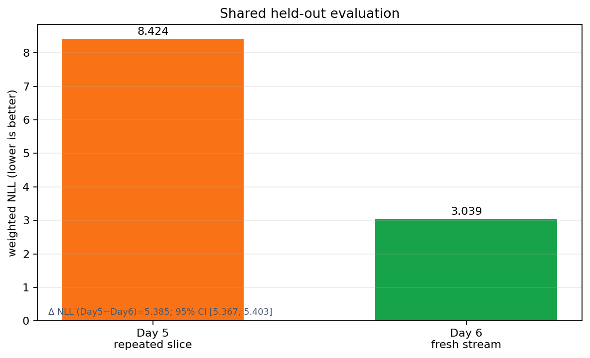
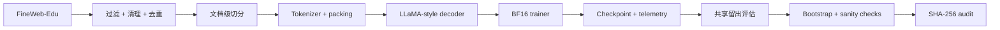
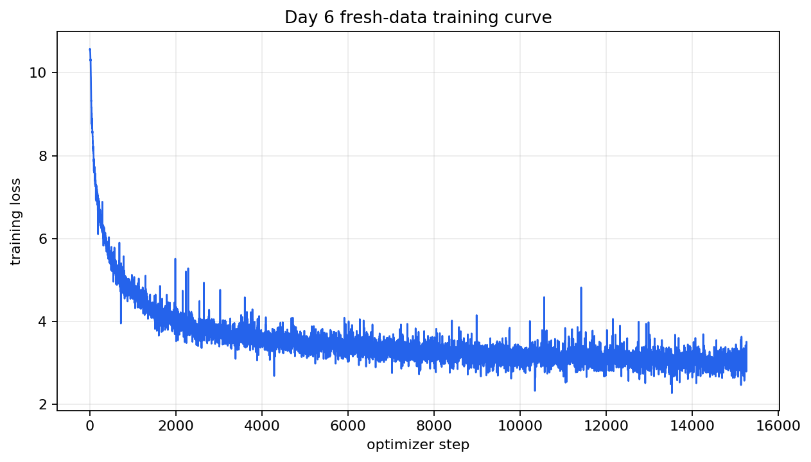
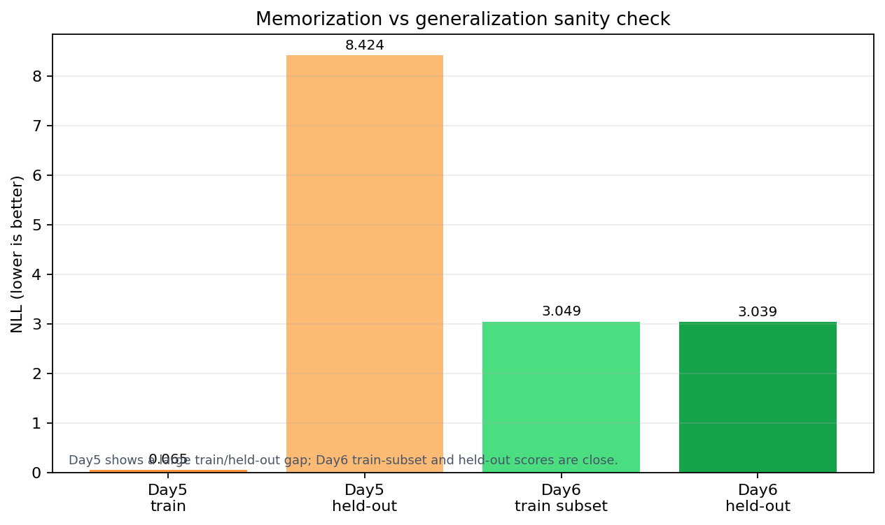
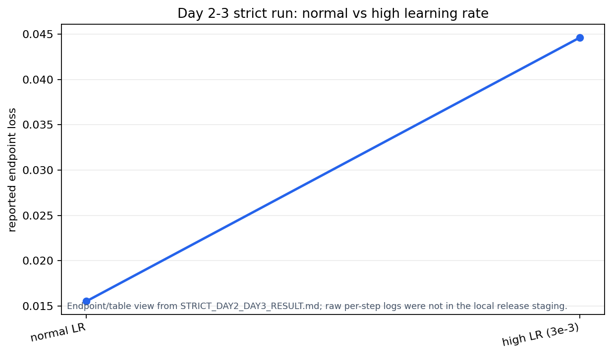
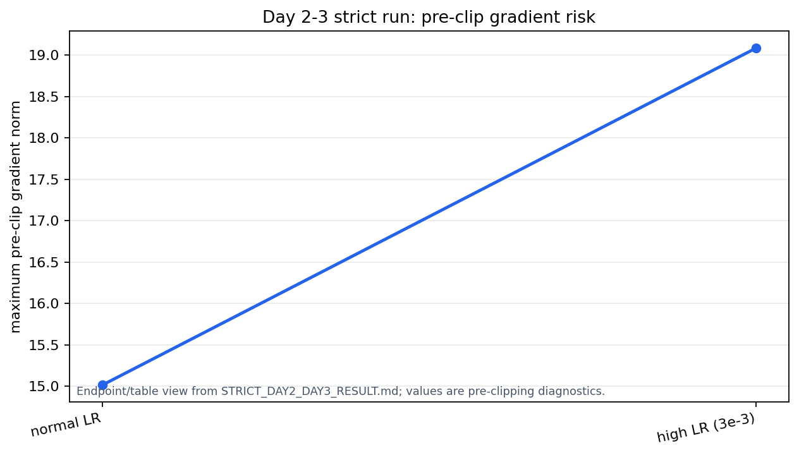

<div align="center">

# PretrainLab-X

### 一套面向真实预训练流程的 LLaMA 风格训练系统：数据、训练稳定性、长程实验、泛化评估与可复现审计

**336M 长程预训练 · 约 5 亿 processed token positions · FineWeb-Edu · 故障注入 · 共享留出评估 · 可复现审计**


[English](README.md) · **简体中文** · [技术报告](results/pdf/PretrainLab-X_Day8_Technical_Report.pdf) · [复现说明](REPRODUCIBILITY.md) · [核心指标](results/final_metrics.json)

</div>

---

## 核心数字

| | |
|---|---:|
| **完成长程训练的主模型** | 336,118,784 参数 |
| **已验证的最大模型路径** | 653,477,120 参数 |
| **长程训练预算** | 15,259 optimizer steps |
| **处理 token positions** | 500,006,912 |
| **不回放训练语料** | 505,007,770 个训练 token |
| **共享留出评估** | 8,666 篇文档 / 9,992,428 个可评分 token |
| **共享留出 NLL** | 8.424 → **3.039** |
| **配对 NLL 差值** | 5.3848 |
| **95% 配对 Bootstrap 区间** | [5.3671, 5.4029] |
| **正式长跑硬件** | 1 × NVIDIA RTX PRO 6000 96GB |

<p align="center">
  
</p>

## 项目主线

PretrainLab-X 覆盖了一个基础模型预训练项目真正需要打通的核心链路：**模型架构、数据管线、训练引擎、稳定性监控、checkpoint 恢复、规模放大、长程训练、统一评估、统计检验与结果审计**。项目从一个可运行的小规模训练栈逐步扩展到 336M / 653M 参数配置，并最终完成两次 336M、15,259 steps、约 5 亿 token positions 的长程训练。

第一次 336M 长跑很快暴露出一个比“loss 能不能继续下降”更关键的问题：**5 亿次 token 消费背后，实际只有 990 万 token 的训练语料在被反复重放。** 这使项目从单纯验证训练系统，进一步转向研究数据覆盖率对模型行为的影响。随后重新构建了一套约 **5.05 亿 train tokens** 的 FineWeb-Edu 数据流，在保持模型规模和训练预算基本一致的条件下，再完成一次无数据集回放的 336M 长程训练。

两次训练结束后，没有只比较各自的 training loss，而是把两个 checkpoint 放进同一套独立评估体系：统一模型配置、Tokenizer、上下文长度、评估代码和共享 held-out corpus，在 **8,666 篇文档、9,992,428 个可评分 token** 上进行 next-token evaluation，并进一步做 **10,000 次 paired bootstrap**。最终 Day 5 与 Day 6 的 weighted NLL 分别为 **8.424 和 3.039**。

这个差距又引出了下一层问题：它究竟来自真正的泛化差异，还是 checkpoint、评估代码、数值精度、数据重叠或训练集记忆造成的假象？因此项目继续向下做了 checkpoint strict loading、模型配置一致性检查、random-init baseline、Day 5 原训练集回测、Day 6 训练子集回测、BF16 / FP32 交叉评估、held-out overlap screening、SHA-256 多实现交叉审计。最终形成的不是一条单纯的训练曲线，而是一条完整的 **“训练 → 发现异常 → 重新设计实验 → 复现实验 → 独立评估 → 反向验证 → 审计结果”** 链路。

整个项目的推进路线可以概括为：

```text
模型 + 训练引擎
      ↓
真实数据管线
      ↓
规模放大验证
      ↓
336M 重复语料长跑
      ↓
发现数据回放问题
      ↓
重建约 5.05 亿 token 不回放语料
      ↓
相同 336M / 相近 token 预算重新长跑
      ↓
共享留出考试
      ↓
Bootstrap + Sanity Check + Hash Audit
```

## 系统实现

### 模型
- Decoder-only Transformer。
- **RMSNorm、RoPE、SwiGLU、GQA**。
- 336M 主配置使用 16 个 Query Head / 4 个 KV Head。
- 注意力后端为 PyTorch scaled-dot-product attention，运行记录为 `sdpa_auto`。
- 支持 activation checkpointing。
- 336M 主配置：`dim=1024`、24 层、16 个 Query Head、4 个 KV Head、上下文长度 512。

### 训练引擎
- **BF16** 混合精度训练。
- Gradient accumulation 与 gradient clipping。
- Warmup + cosine learning-rate schedule。
- Stateful checkpoint：保存 model、optimizer、scheduler、RNG 状态。
- 从 step 400 → 500 的 checkpoint resume 已实际验证。
- JSONL 记录 loss、learning rate、裁剪前 gradient norm、GPU 显存/利用率和 throughput。
- 监控与干预解耦：监控器负责记录、诊断和报警，不在训练过程中偷偷改学习率、batch size 或 optimizer 状态。

### 数据与评估
- FineWeb-Edu 接入、过滤、精确文本去重、文档级切分、tokenization 与 packing。
- Tokenizer 来源与 token 文件 SHA-256。
- 两份冻结 checkpoint 使用统一共享留出集做 next-token evaluation。
- Token-weighted NLL、Perplexity、文档级 paired bootstrap。
- Random baseline、BF16/FP32 交叉核验、overlap audit、checkpoint/config 一致性检查。



## 数据工程：从 10M token 小切片到 510M token 语料

数据管线实际上经历了两次扩展。

### 第一阶段：接入真实 FineWeb-Edu

第一套真实数据管线使用 FineWeb-Edu `sample-10BT`，构建出 10M-token 语料：

| 项目 | 数值 |
|---|---:|
| 检查文档 | 8,479 |
| 保留文档 | 8,478 |
| 删除精确重复文档 | 1 |
| 清理后字符数 | 39,822,471 |
| 总 token | 10,000,000 |
| train / validation | 9,900,000 / 100,000 |
| Tokenizer | TinyLlama，vocab 32,000，EOS 2 |

这一阶段把真实网页数据的过滤、清洗、去重、切分、tokenization 和内容哈希链路跑通；后续 Day 5 的重复语料长跑就是建立在这个 9.9M-token train slice 上。

### 第二阶段：重建不回放长程语料

Day 6 从约 2.15 GB 的 FineWeb-Edu Parquet 源重新构建训练集，并在文档边界先做 train/validation 切分，再进行 packing：

| 项目 | 数值 |
|---|---:|
| 训练文档 | 427,260 |
| 验证文档 | 4,243 |
| 删除精确重复文档 | 395 |
| 训练 token | 505,007,770 |
| 验证 token | 5,000,809 |
| 总 token | 510,008,579 |
| packed token 文件 | 2,040,034,316 bytes (`int32`) |

原始 Parquet 在预处理前先做完整性检查；处理后的 token stream 和元数据保留 SHA-256 记录。验证完成后删除原始大文件，避免无意义占用远端存储。

## 模型放大与分布式路径验证

正式长跑之前，先在真实 FineWeb-Edu 管线上验证更大的模型配置和分布式代码路径。

| 配置 | 参数量 | Steps | 精度 | 验证内容 |
|---|---:|---:|---|---|
| 336M benchmark | 336,118,784 | 8 | BF16 | forward / backward / update |
| 653M benchmark | 653,477,120 | 4 | BF16 | 更大模型路径 |
| FSDP path | 336,118,784 | 16 | BF16 | init / wrap / forward / backward / optimizer |

FSDP 这次使用 `world_size=1`，PyTorch 实际为 `NO_SHARD`。因此这里证明的是代码路径可运行，不把它写成已经完成多卡通信或真实参数分片。

同时生成了 scaling report 与机器可读 summary。

## 两次 336M 长程训练

两次正式长跑使用相同的 336,118,784 参数模型，并保持相同的 15,259 step / 500,006,912 token-position 预算。

| | Day 5 — 重复语料 | Day 6 — 不回放语料 |
|---|---:|---:|
| 模型 | 336,118,784 参数 | 336,118,784 参数 |
| Steps | 15,259 | 15,259 |
| 每步 token | 32,768 | 32,768 |
| 处理 token positions | 500,006,912 | 500,006,912 |
| 底层 train corpus | 9.9M token | 505,007,770 token |
| 数据方式 | 小切片反复回放 | 不进行 dataset replay |
| 精度 | BF16 | BF16 |
| 训练耗时 | 约 3 小时 31 分 | 约 3.55 小时 |
| 最终 checkpoint | 约 4.03 GB | 约 4.03 GB |

Day 5 的记录显示平均吞吐 **39,424.75 token/s**、平均 GPU 利用率 **77.24%**、峰值训练显存约 **7.3 GB**。训练最终正常完成；过程中出现的低 GPU 利用率采样警告被保留下来，没有把它隐藏成“全程无告警”。

Day 6 先完成 **100-step smoke test**，再启动正式长跑；正式训练最佳 validation loss 为 **3.14276（step 15,000）**，并保留了完整 JSONL 长程轨迹。

<p align="center">
  
</p>

## Day 5 / Day 6 共享留出考试

两份 checkpoint 都冻结后，再使用完全相同的模型加载与 next-token 评估协议。两者都处于 step 15,259，模型结构、Tokenizer、词表、EOS 和上下文长度一致。

### 留出集构建与重叠控制

共享留出数据来自 FineWeb-Edu `sample-10BT` 的候选分片 `013_00000.parquet`：

- 检查 8,681 条候选记录。
- 保留 8,666 篇完整文档。
- 构建 10,000,094 个 token。
- 与训练数据使用同一套清洗和 Tokenizer 路径。
- 候选集内部执行精确文本去重。
- 针对可重建的 Day 5 9.9M-token 流执行 **64-token window / stride 16 的 SHA-256 重叠筛查**。
- **15 篇候选文档被筛掉**。
- 候选分片与 Day 6 训练分片 `000_00000.parquet` 不同。

由于 Day 5 当时通过 dataset-server API 取数，没有保留完整的原始 shard / URL provenance，因此这里只报告已经实际证明的 **token-window screening + source-shard separation**，不夸大成语义层面或 URL 层面的绝对零重叠。

### 完全统一的评估协议

两个模型都使用：

- `model.eval()`
- `torch.inference_mode()`
- BF16 autocast
- 不做 backward
- 不做 optimizer update
- token-weighted causal cross-entropy
- 同一份评估脚本和同一份 held-out stream

请求预算为 10M token；因为每篇完整文档最后一个 token 没有可用的 next-token target，最终得到 **9,992,428 个可评分 token**。

| Checkpoint | 文档数 | 可评分 token | Weighted NLL | Perplexity |
|---|---:|---:|---:|---:|
| **Day 5 重复语料** | 8,666 | 9,992,428 | **8.424211** | 4,556.051 |
| **Day 6 不回放语料** | 8,666 | 9,992,428 | **3.039400** | 20.893 |

<p align="center">
  
</p>

随后对相同的 8,666 个文档 ID 做 **10,000 次 paired bootstrap**（seed `1337`），并保留每篇文档的 token 权重：

- Day 5 − Day 6 weighted NLL：**5.384811**
- 95% percentile interval：**[5.367100, 5.402861]**

README 把 NLL 作为主结果；Perplexity 作为辅助指标，因为它是 NLL 的指数变换。

## 差距太大，所以继续反向验证

共享留出结果的差距足够大，因此后续并没有“看到好结果就停止”，而是专门增加 Day 7 的只读 Sanity Check：**不重新训练、不更新任何权重，先假设这个结果有可能是错的，再逐项排除。**

### 1. Checkpoint 完整性
两个 336M checkpoint 都重新做 SHA-256 和 `strict=True` 加载：

- `missing_keys = []`
- `unexpected_keys = []`
- 两边参数量都是 336,118,784
- 两边都在 step 15,259

### 2. 模型配置一致性
逐项确认两边完全一致：

- hidden size `1024`
- 24 层 Transformer
- 16 个 Query Head
- 4 个 KV Head
- context length `512`
- vocab `32,000`
- EOS `2`
- 同一个 TinyLlama Tokenizer

最终：`day5_day6_model_config_equal = true`。

### 3. Random baseline
用相同结构、相同评估协议的随机初始化模型，在前 500,000 个可评分 token 上测试：

- NLL：**10.574821**
- Perplexity：约 **39,100**

随机模型明显更差，说明评估代码确实对模型能力敏感，而不是无论什么模型都给出近似固定分数。

### 4. 回到训练侧重新考试
又把两个训练完成的模型分别拿回训练侧数据重新评估：

| Checkpoint | 训练侧 NLL | 共享留出 NLL | 现象 |
|---|---:|---:|---|
| **Day 5** | 原始 9.9M 训练切片上 **0.065023** | **8.424211** | 巨大的 train / held-out gap |
| **Day 6** | 固定 10M 训练前缀上 **3.049181** | **3.039400** | 训练子集与留出集接近 |

<p align="center">
  
</p>

这一层检查是整个项目里支持 **memorization vs generalization** 解释最直接的证据。需要注意，Day 6 的训练侧只是固定 10M 前缀，不等于完整 505M-token 训练语料。

### 5. BF16 / FP32 数值交叉核验
在同一留出集前 100,000 个可评分 token 上，用 BF16 和 FP32 分别重新评估：

| 模型 | BF16 NLL | FP32 NLL | FP32 − BF16 |
|---|---:|---:|---:|
| Day 5 | ~8.424 | ~8.424 | −0.0001667 |
| Day 6 | ~3.039 | ~3.039 | −0.0000198 |

两种精度的差异极小，而且模型排名完全不变，因此“BF16 数值误差制造了巨大差距”这个解释基本站不住。

### 6. 再次复现共享考试结果
Day 7 的 sanity-check 阶段重新得到约 **8.424 vs 3.039** 的共享留出结果，与 Day 6.6 正式评估一致。

这一整套反向验证大幅降低了以下可能性：

- checkpoint 损坏或被替换；
- 两个模型结构不一致；
- 评估脚本对两边使用了不同协议；
- 随机模型也会得到同样“好成绩”；
- BF16 数值误差改变模型排序；
- 训练侧结果缺失导致误判。

## 训练稳定性、故障注入与恢复

训练系统不是只在“正常配置”下跑一次，还专门做过异常优化条件下的压力测试。

### 正常基线 vs 高学习率压力实验

同一个 30.42M 参数模型分别完成正常配置和高学习率 `3e-3` 的 500-step 独立训练。

| 实验 | 最终 loss | 最佳 loss | 最大裁剪前 grad norm | Validation loss |
|---|---:|---:|---:|---:|
| **Normal LR** | **0.015530** | 0.014527 | 15.012 | 0.015689 |
| **High LR (`3e-3`)** | **0.044620** | 0.042047 | **19.085** | 0.046229 |

高学习率组没有直接炸成 NaN / Inf，但最终 loss 和 validation loss 明显更差，裁剪前梯度也更大。

Observatory 记录的是 **gradient clipping 之前**的全局梯度范数；真正 optimizer update 之前仍执行 `grad_clip=1.0`。因此系统既能看到风险信号，又不会把相同幅度直接作用到参数更新。

### 主动异常注入

另外单独运行了确定性的 anomaly demo，人为构造异常训练轨迹，并能稳定触发：

- `loss_spike`
- `gradient_explosion_risk`

这部分验证的是诊断链路，而不是拿异常实验刷模型指标。

### Recovery run

高学习率压力实验之后，恢复正常 learning rate、warmup 和 gradient clipping，再独立运行完整 500 steps：

- final loss：`0.015530`
- best loss：`0.014527`
- validation loss：`0.015689`

恢复组重新回到正常 baseline。

### Stateful checkpoint resume

每 100 step 保存一次 checkpoint，并包含 model、optimizer、scheduler 与 RNG 状态。随后从 step 400 的 checkpoint 恢复到 step 500，最终重新得到 `0.015530`，与原始正式 run 的 step-500 结果一致。

因此这里验证的是**完整训练状态恢复**，而不是只证明模型权重能被读出来。

<details>
<summary><b>诊断端点视图</b></summary>

<br>

<p align="center">
  
</p>

<p align="center">
  
</p>

</details>

## 可复现性与文件审计

项目不只保留截图或手工抄写的数字，而是同时保存机器可读结果和阶段报告。

Day 7 完成后，又直接回到最终实验使用的三个原始文件，用 **三种独立实现**重新计算 SHA-256：

- `sha256sum`
- OpenSSL
- Python `hashlib`

三种方法对以下三份文件全部得到一致结果：

- Day 5 checkpoint
- Day 6 checkpoint
- shared held-out token stream

这一步还发现并修正了早期文档中的两处人工转录错误：held-out hash 少了一个字符，Day 6 checkpoint hash 出现过相邻字符转置。补丁只修正文档和文件指纹，**没有重新训练、没有重新评估，也没有修改模型权重、训练历史或指标**。修补前版本继续保留用于审计对照。

权威证据入口：

- [`results/final_metrics.json`](results/final_metrics.json)
- [`audit/CANONICAL_HASH_MANIFEST.json`](audit/CANONICAL_HASH_MANIFEST.json)
- [`audit/HASH_CROSSCHECK.json`](audit/HASH_CROSSCHECK.json)
- [`results/`](results/)
- [`figures/`](figures/)
- [`results/pdf/PretrainLab-X_Day8_Technical_Report.pdf`](results/pdf/PretrainLab-X_Day8_Technical_Report.pdf)

最终公开发布包还重新执行了 RMSNorm、RoPE、SwiGLU、GQA、完整模型前向和训练观测逻辑等组件级自检，并通过发布审计脚本检查必需文件、JSON、哈希格式、禁止的大文件后缀和明显敏感信息。

## 仓库结构

```text
model/          LLaMA 风格模型与注意力组件
engine/         trainer、scheduler、optimizer 与 checkpoint
data/           数据预处理与 tokenizer 适配
distributed/    FSDP 入口与封装
evaluation/     留出评估、bootstrap、sanity 与 audit
monitor/        JSONL 日志、GPU/梯度监控与异常诊断
experiments/    benchmark 与 long-run 配置/脚本
results/        实验报告与机器可读证据
figures/        基于仓库内证据生成的发布图表
audit/          权威哈希清单与交叉核验
docs/           系统设计、数据、实验与评估说明
tests/          组件级自检
```

## 快速运行

公开仓库不会提交原始语料、packed token 数组和大模型 checkpoint。使用准备好的本地小型数据即可跑 smoke configuration：

```bash
python -m venv .venv
. .venv/bin/activate
pip install -r requirements.txt

python prepare_data.py --config configs/debug.yaml
python train.py --config configs/debug.yaml
python verify_run.py --run-dir .
```

完整实验配置、数据假设和 GPU 复现边界见 [`REPRODUCIBILITY.md`](REPRODUCIBILITY.md)。

## 范围与边界

**336M** 是完成正式长程训练和对照评估的主模型。**653M** 只完成短程路径验证，不描述为完成长训。FSDP 仅在 `world_size=1` 下验证，因此不声称已经完成多 GPU 扩展。实验记录中的注意力后端为 **PyTorch SDPA**，不是第三方 `flash-attn` 安装。

Day 5 / Day 6 的结果支持本实验设置下明显的**记忆化—泛化差异**，但不能被写成“只要数据更新/不重复就一定更好”的普遍因果规律：两份 checkpoint 的完整训练历史并不完全相同，而且 Day 5 没有保留足够的原始来源信息来证明与留出集在语义或 URL 层面绝对零重叠。

完整限制说明见 [`LIMITATIONS.md`](LIMITATIONS.md)。

---

<div align="center">

**PretrainLab-X** · 预训练系统、数据管线、故障诊断与证据驱动评估

</div>
